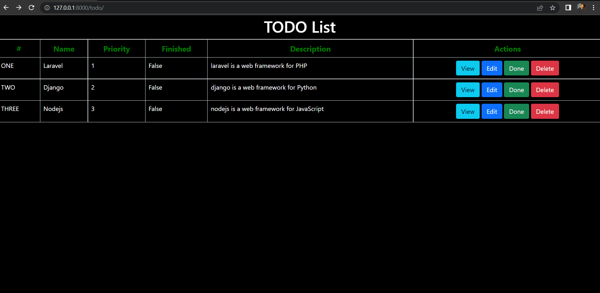

# Django - Lab 1



## Commands
```
py -m venv env
```
```
env\Scripts\activate.bat
```
```
py -m pip install Django
```
```
django-admin startapp lab1
```
```
django-admin startproject first_app
```
```
python first_app/manage.py runserver
```
```
cd first_app
```
```
django-admin startapp todo
```

# Author
* LinkedIn - [Mahmoud Mohamed Kamal](https://www.linkedin.com/in/mahmoudfierro98)

<p align="right">(<a href="#top">Top</a>)</p>
